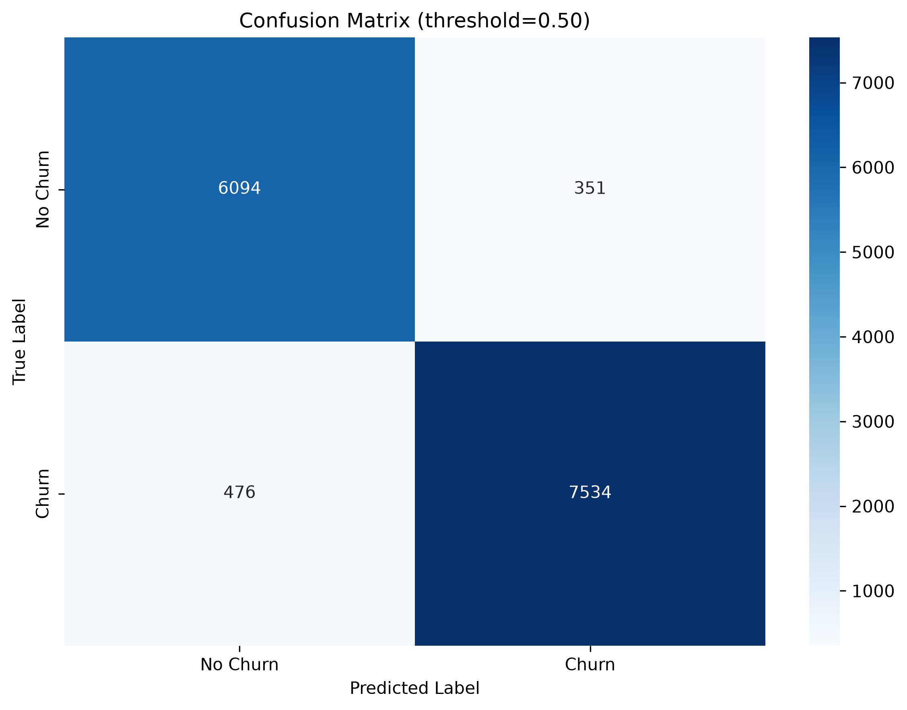
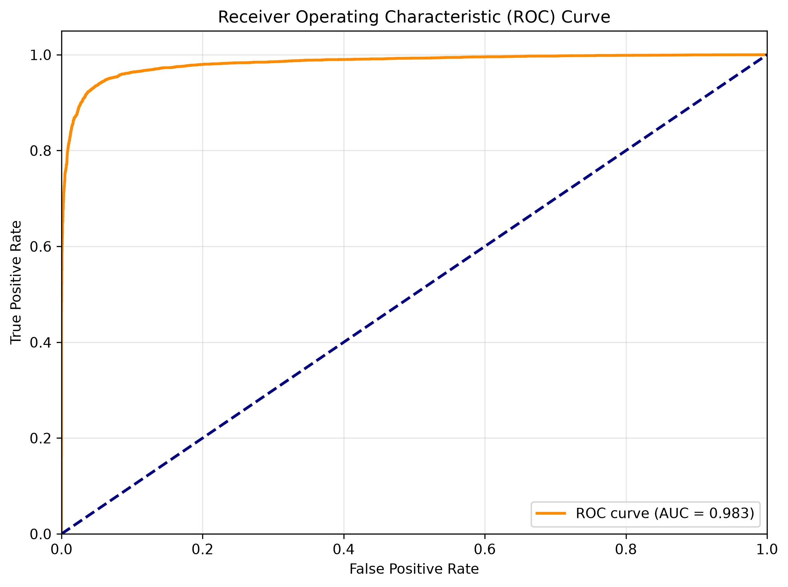
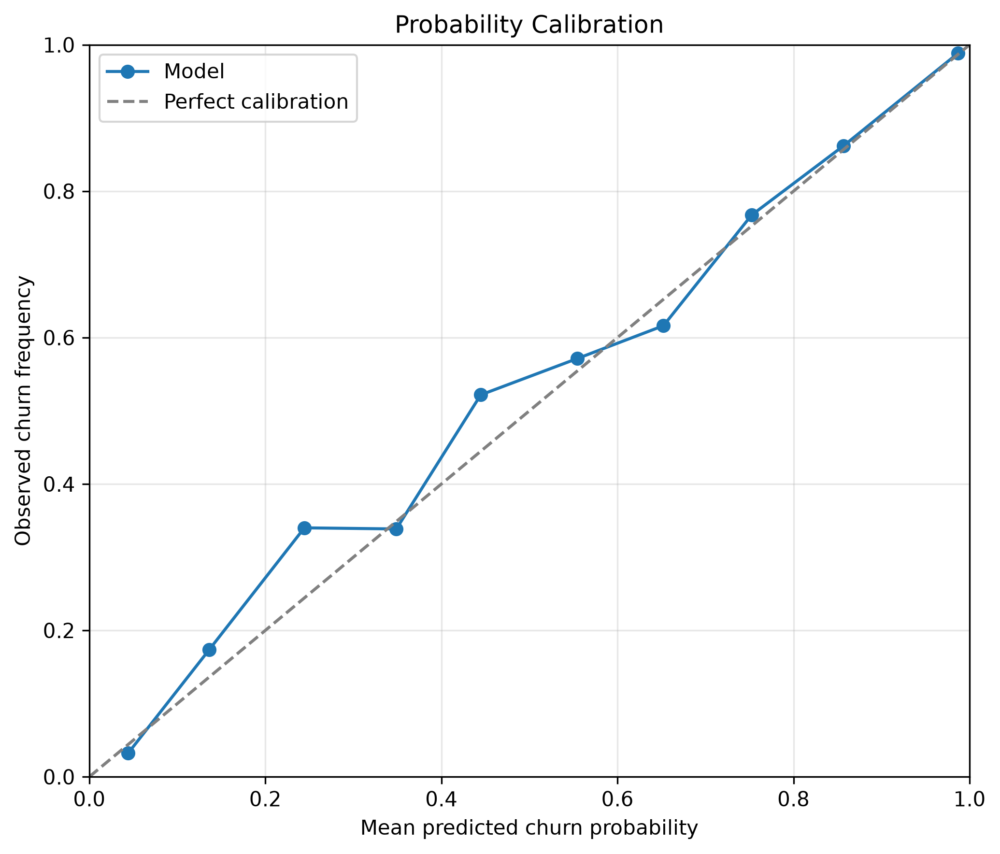
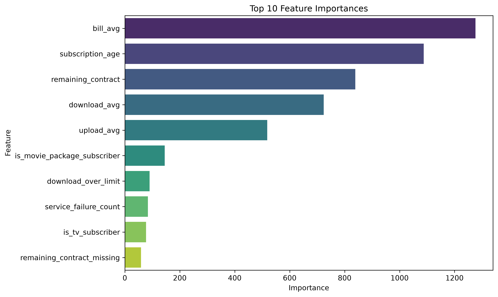

# Customer churn modeling report

## Executive summary

The final training run compared seven classifiers on a customer churn dataset containing 72,274 rows and 11 columns. The selected LightGBM model achieved repeated-CV ROC-AUC of **0.9818 ± 0.0009** and holdout ROC-AUC of **0.9829**. At the fixed probability cutoff of 0.5, holdout accuracy was **94.28%** (13,628 of 14,455 predictions correct), with a Brier score of **0.0448**.

Selection used mean ROC-AUC from repeated stratified three-fold cross-validation on training data; the 20% stratified holdout was reserved for final reporting. Holdout metric leaders differ: Gradient Boosting has the highest Accuracy and F1 and the lowest Brier score, LightGBM has the highest Recall, and XGBoost has the highest Precision. The 0.5 decision cutoff represents the requested equal false-positive/false-negative cost assumption, not a business-validated optimum.

`remaining_contract` is missing for 29.85% of all records. Its missingness is strongly associated with the churn label and varies across subscription segments, requiring data-lineage investigation. The dataset has no timestamp, so future/time-based validation was not possible.

## Scope and artifacts

This report summarizes the EDA notebook, regenerated benchmark, holdout predictions, and figures:

- EDA notebook: [01_eda_and_modeling.ipynb](../notebooks/01_eda_and_modeling.ipynb)
- Model comparison and tuned parameters: [model_results.csv](../models/model_results.csv)
- Row-level holdout predictions and risk bands: [predictions_analysis.csv](../models/plots/predictions_analysis.csv)
- Holdout metrics: [holdout_metrics.csv](../models/plots/holdout_metrics.csv)
- Missingness by target and segment: [missingness_diagnostics.csv](../models/plots/missingness_diagnostics.csv)
- Preprocessing and training pipeline: [data_preprocessing.py](../src/data_preprocessing.py), [model_training.py](../src/model_training.py)
- Evaluation and chart generation: [model_evaluation.py](../src/model_evaluation.py)

## Data profile and preparation

The source dataset contains an identifier (`id`), nine predictors, and binary target `churn`. The identifier is excluded from modeling. Churn represents approximately 55.4% of the rows. The stratified 80/20 split yields 57,819 training rows and 14,455 holdout rows.

| Feature | Missing rows | Missing share |
|---|---:|---:|
| `remaining_contract` | 21,572 | 29.85% |
| `download_avg` | 381 | 0.53% |
| `upload_avg` | 381 | 0.53% |

`download_over_limit` is a numeric count with source values from 0 through 7; it is not a binary flag. The preprocessing pipeline creates `remaining_contract_missing`, median-imputes numeric features, mode-imputes binary subscription indicators, and scales numeric features. The split occurs before fitting preprocessing. Imputation, missingness handling, and scaling are fitted within each CV training fold; the final selected pipeline is refitted on the entire training partition and applied unchanged to the holdout.

## Model selection and holdout comparison

The search used repeated stratified three-fold CV with two repeats (six fold evaluations per candidate) and up to 12 randomized candidates for tuned models. Candidates were compared by mean training CV ROC-AUC. Holdout metrics are reported only after selection and do not drive model choice.

| Model | CV ROC-AUC (mean ± std) | Accuracy | Precision | Recall | F1 | Holdout ROC-AUC | Brier | Selected parameters |
|---|---:|---:|---:|---:|---:|---:|---:|---|
| LightGBM | **0.9818 ± 0.0009** | 0.9428 | 0.9555 | **0.9406** | 0.9480 | **0.9829** | 0.0448 | `num_leaves=50`, `n_estimators=100`, `max_depth=15`, `learning_rate=0.1` |
| Random Forest | 0.9810 ± 0.0004 | 0.9409 | 0.9566 | 0.9358 | 0.9461 | 0.9819 | 0.0461 | `n_estimators=200`, `min_samples_split=5`, `min_samples_leaf=2`, `max_depth=None` |
| Gradient Boosting | 0.9808 ± 0.0009 | **0.9438** | 0.9574 | 0.9404 | **0.9489** | 0.9828 | **0.0446** | `n_estimators=200`, `max_depth=7`, `learning_rate=0.1` |
| XGBoost | 0.9804 ± 0.0008 | 0.9412 | **0.9576** | 0.9353 | 0.9463 | 0.9811 | 0.0469 | `subsample=1.0`, `n_estimators=200`, `max_depth=5`, `learning_rate=0.1`, `colsample_bytree=1.0` |
| Decision Tree | 0.9708 ± 0.0011 | 0.9376 | 0.9504 | 0.9362 | 0.9433 | 0.9739 | 0.0507 | `min_samples_split=10`, `min_samples_leaf=4`, `max_depth=10` |
| KNN | 0.9584 ± 0.0005 | 0.9202 | 0.9369 | 0.9177 | 0.9272 | 0.9606 | 0.0656 | `weights=distance`, `n_neighbors=9`, `metric=manhattan` |
| Logistic Regression | 0.9334 ± 0.0011 | 0.8758 | 0.8745 | 0.9057 | 0.8899 | 0.9309 | 0.0974 | `solver=liblinear`, `penalty=l2`, `C=0.01` |

The leading models have close CV ROC-AUC scores; LightGBM's CV advantage over Random Forest is about 0.0008. Treat this small difference cautiously and compare it with operational costs and stability. A separate, future dataset or repeated external validation would help assess generalization.

## Selected model: holdout errors and thresholds

The classifier labels a customer as churn risk when its estimated probability is at least 0.5.

| Actual \ Predicted | No churn | Churn |
|---|---:|---:|
| No churn | 6,094 | 351 |
| Churn | 476 | 7,534 |

| Holdout result | Value |
|---|---:|
| Number of customers | 14,455 |
| Correct classifications | 13,628 (94.28%) |
| Errors | 827 (5.72%) |
| Precision | 0.9555 |
| Recall | 0.9406 |
| F1 | 0.9480 |
| ROC-AUC | 0.9829 |
| Brier score | 0.0448 |
| Missed churners (false negatives / actual churners) | 5.94% |
| False churn flags (false positives / actual non-churners) | 5.44% |

ROC-AUC measures ranking over thresholds, not probability calibration. The Brier score summarizes squared probability error, while the calibration curve compares predicted probabilities with observed churn frequency across bins. Inspect the curve before interpreting an individual score as a calibrated probability.

Risk-band policy is shared by the application and holdout analysis: Low `<0.30`, Medium `0.30–<0.70`, and High `>=0.70`.

| Risk band | Holdout customers | Actual churn | Churn rate |
|---|---:|---:|---:|
| Low | 6,328 | 373 | 5.9% |
| Medium | 560 | 293 | 52.3% |
| High | 7,567 | 7,344 | 97.1% |
| **Total** | **14,455** | **8,010** | **55.4%** |

These risk-band rates are descriptive for this random holdout. They do not demonstrate that acting on the groups improves retention.

## Feature importance

The selected LightGBM model's split-count importances rank the displayed predictors as follows. These are raw split counts, not normalized gain or causal effects.

| Feature | Split importance |
|---|---:|
| `bill_avg` | 1,276 |
| `subscription_age` | 1,088 |
| `remaining_contract` | 839 |
| `download_avg` | 724 |
| `upload_avg` | 518 |
| `is_movie_package_subscriber` | 145 |
| `download_over_limit` | 90 |
| `service_failure_count` | 84 |
| `is_tv_subscriber` | 77 |
| `remaining_contract_missing` | 59 |

`remaining_contract_missing` contributes less split importance than the top usage, billing, and contract-duration features. Importance is model-specific and does not communicate direction, marginal effect, or causality.

## Missing-contract diagnostics

| Segment | Customers | Missing contract | Missing rate |
|---|---:|---:|---:|
| Overall | 72,274 | 21,572 | 29.85% |
| No churn | 32,224 | 1,853 | 5.75% |
| Churn | 40,050 | 19,719 | 49.24% |
| No TV subscription | 13,352 | 7,962 | 59.63% |
| TV subscription | 58,922 | 13,610 | 23.10% |
| No movie package | 48,089 | 17,609 | 36.62% |
| Movie package | 24,185 | 3,963 | 16.39% |

Missingness is also higher at larger `download_over_limit` counts (for example, 27.66% at zero and 84.33% at seven), though the higher-count groups are much smaller. The CSV includes all count values. These relationships justify auditing how contract duration is collected and whether missing values have a consistent business meaning; they do not identify the cause.

## Evaluation against project requirements

The project provides exploratory analysis, a leakage-safe preprocessing and training pipeline, comparison of seven classifiers, standard classification metrics, probability calibration diagnostics, and a Streamlit interface for single and batch predictions. Risk classification uses one shared policy across model evaluation and application views. The complete workflow is run with `bash run_all.sh`; generated measurements and plots are saved beneath `models/`.

## Limitations and recommended next steps

- The holdout is one random split from the same source population, not an independent external or time-based evaluation. The available data has no timestamp.
- The cutoff assumes equal error costs. Replace this assumption with retention-action costs, capacity limits, and observed intervention outcomes; tune a decision threshold on training/validation data, not on the final holdout.
- High ranking performance does not guarantee calibrated probabilities. Monitor calibration on later cohorts and recalibrate only with suitable validation data.
- Strong target and segment associations in contract missingness warrant a data-lineage audit and a check that the missingness mechanism remains stable.
- Report operational metrics such as precision/recall at campaign capacity, lift, and retained-customer outcomes before claiming business impact.

